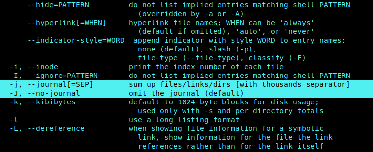
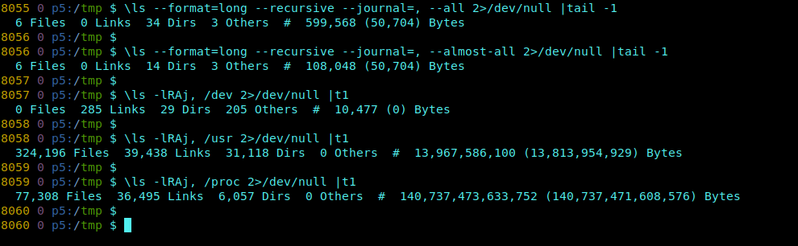
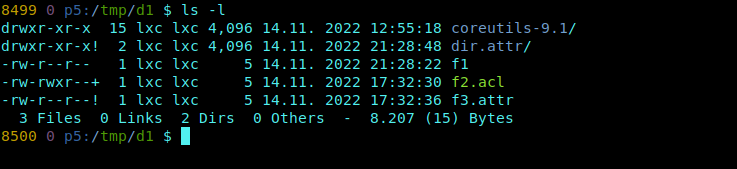

# ls-journal

*coreutils ls summary option*


The coreutils `ls` should have a **summary option**.

Count the *Files* and *Dirs* incl. *Subdirs* and indicate the exact *Sizes*.

Because `-s` is used, I choose `-j|--journal`.

You can set a **thousands separator**. By default, there is none and the whole option is turned off.

You can force off with `-J|--no-journal`.



* tar packages:  
https://ftp.gnu.org/gnu/coreutils/coreutils-8.32.tar.xz  
https://ftp.gnu.org/gnu/coreutils/coreutils-9.1.tar.xz

* github repo:  
https://github.com/coreutils/coreutils

The source is in `./src/ls.c`

-----
**Provided versions - 8.32, 9.1**

```
v=8.32
patch --verbose --unified --output=ls.c_${v}_patched.c ls.c_${v}_orig.c ls.c_${v}.diff
```

* example build (archive):

```
## debian live
sudo apt install libacl1-dev  # depends on libattr1-dev

cd src/
patch ls.c path/ls.diff
cd ..

mkdir my
cd my
../configure
```

* build only exe + manpage:

```
echo -e "\nls: \$(BUILT_SOURCES)\n\t\$(MAKE) \$(AM_MAKEFLAGS) src/ls man/ls.1" >>Makefile

make ls
```

* check:

```
src/ls -j src/ls man/ls.1
src/ls -laR -j, ..

strip src/ls
file src/ls
```

* install:

```
sudo cp src/ls /usr/local/bin/ls
hash ls
```

* aliases:

```
ls --journal &>/dev/null && export LS_HAS_JOURNAL=1 || unset LS_HAS_JOURNAL

alias ls='ls ${LS_HAS_JOURNAL+-j,}'
alias l1='ls -1 ${LS_HAS_JOURNAL+--no-journal}'
```



_Congrats, your **ls** has a **journal**!_

-----
**New:**

Disclose _**User** eXtended attributes_!

  
spotted a sneaky user xattr

-----
**Update for coreutils 9.4**

https://ftp.gnu.org/gnu/coreutils/coreutils-9.4.tar.xz

Started in 2013, it's still my most important, _can't-be-without-it_ patch!
